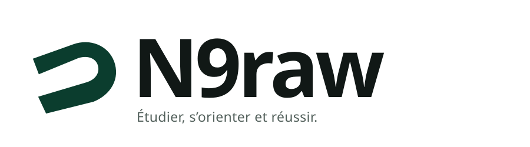

### Étudier, s’orienter et réussir.

**Building the trusted Moroccan Student Operating System — from Bac to orientation, higher education, study abroad, opportunities and first employment.**

[Website](https://www.n9raw.com) · [Contact](mailto:contact@n9raw.com)

---

## N9raw

**N9raw** is building a trusted student platform for Morocco, designed to make the journey from Bac to first employment clearer, more structured and more useful.

We organise information around the student’s **stage, intent and next useful action** — not around disconnected pages, link collections or unverified information.

## What we're building

| Area | Focus |
|---|---|
| **Étudier** | Academic resources, modules, exams, summaries and study methods |
| **S’orienter** | Programmes, institutions, admissions, comparisons and careers |
| **Opportunités** | Scholarships, competitions, internships, jobs and events |
| **Étudier à l’étranger** | Countries, programmes, procedures, funding and deadlines |
| **S’informer** | Verified news, guides, calendars and student life |

Search is a core product principle across the N9raw experience.

## Built on trust

- **Verified information first** — important facts are sourced, reviewed and kept current.
- **Student-first design** — structured around real student needs and next actions.
- **French + Arabic/RTL** — both are first-class experiences.
- **Privacy by default** — with particular care for younger students.
- **Accessible by design** — WCAG 2.2 AA is part of our product standard.
- **Transparent corrections** — important public information has a correction path.
- **Grounded AI only** — AI experiences come after verified structured data and must be grounded and cited.

## N9raw ecosystem

### Nour FPN

**Nour FPN** is the first faculty-specific implementation within the broader Nour initiative, helping students at FPN Nador access useful student services through WhatsApp.

[Discover Nour FPN →](https://www.n9raw.com/fr/nour-fpn/)

## Engineering

N9raw is being built with a modular architecture based on:

**Next.js · React · TypeScript · Laravel · PostgreSQL · Redis · Meilisearch · Cloudflare**

Our core engineering repositories remain private while the platform is under active development.

---

**N9raw**  
*Étudier, s’orienter et réussir.*

Morocco 🇲🇦

